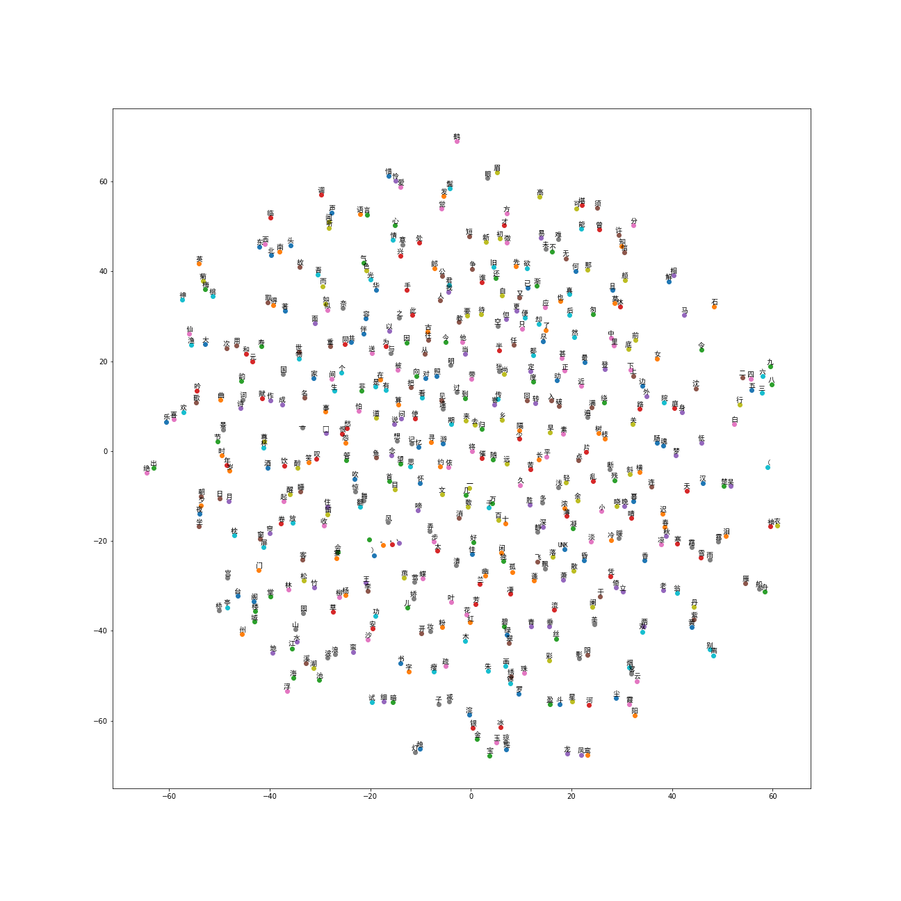
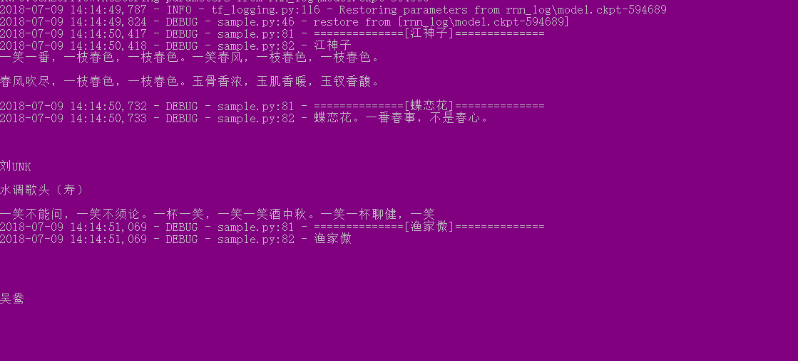
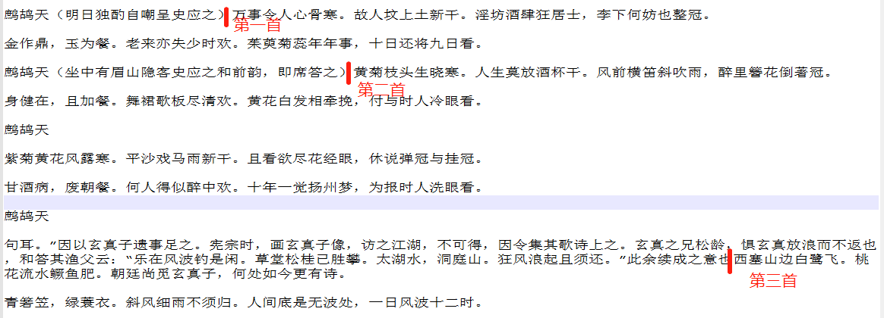
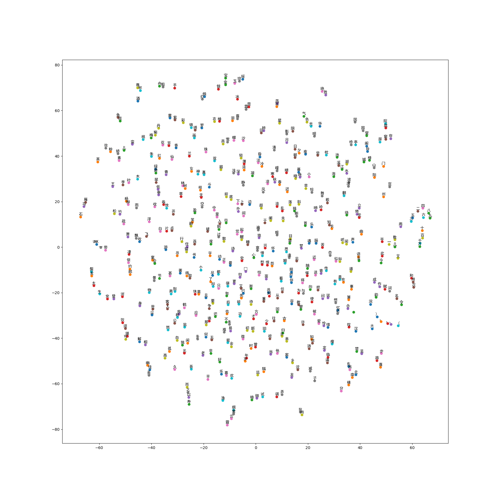

# 训练一个写词机器人

## 主要内容  
- [1.小作业BPTT](#bptt)
- [2.Word Embedding](#wordemd)
- [3.Train RNN](#train)
- [4.Conclusion](#conclusion)

## <span id="bptt">1.小作业BPTT<span>  
具体内容见notebook [BPTT-test](BPTT-Test.ipynb)  
前向传播部分代码：  
```python
# forward pass
for t in range(seq_length):
    xs[t] = inputs[t:t+3].reshape(input_len, 1) # make a matrix(rank 2)
    hs[t] = np.tanh(np.dot(U, xs[t]) + np.dot(W, hs[t-1]) + bs) #计算hidden state。激活函数使用tanh
    ys[t] = np.dot(V, hs[t]) + bo #计算output logits。注意这里没有激活函数，我们将在下一步计算softmax

    ps[t] = np.exp(ys[t]) / np.sum(np.exp(ys[t])) # softmax

    loss = loss - np.sum(np.dot(targets[t], np.log(ps[t]))) # 计算交叉熵
```
反向传播部分主要代码如下：  
```python
  for t in reversed(range(seq_length)):
    dy = np.copy(ps[t])
    dy[targets[t]] -= 1 # softmax-交叉熵delta： y-t
    #print('dy:',dy)
    dV = dV + np.dot(dy,hs[t].T) #V-nabla
    #print('dV:',dV)
    dbo = dbo + dy  #bo-nablas
    dh = np.dot(W.T, dhnext) + np.dot(V.T, dy) # backprop into hidden-state
    dhraw = (1 - hs[t] * hs[t]) * dh # tanh的导数是1-logits^2
    dbs = dbs + dhraw  #bs-nabla
    if t>0:
      dW = dW + np.dot(dhraw, hs[t-1].T) # W-nabla
      #print('dW:',dW)
    dhnext = dhraw
    #print('dhraw:',dhraw)
    
    #print('xs[t].T',xs[t].T)
    dU = dU + np.dot(dhraw, xs[t].T) # U-nabla
```
个人觉得主要难点是dU的计算上，课件中公式描述有错。U和W的更新实际上都是依赖dhraw。  

## <span id="wordemd">2.Word Embedding<span>
### 2.1 Code  
基于[word2vec_basic.py]()修改较小，主要包括:  

**数据读入**：  
```python
# Read the data into a list of strings.
def read_data(filename):
    with open(filename, encoding="utf-8") as f:
        data = f.read()
    data = list(data)
    return data

filename = 'data/QuanSongCi.txt'
vocabulary = read_data(filename)
```

**训练参数修改**：
```python
vocabulary_size = 5000
num_steps = 400001
```  

**生成的文件包括**：  
[embedding.npy](./data/)  
[dictionary.json](./data/dictionary.json)  
[reverse_dictionary.json](./data/reverse_dictionary.json)

### 2.2 结果显示  
matplotlib对中文显示的支持需要修改的代码如下：  
```python
from matplotlib.font_manager import FontProperties
font_chn = FontProperties(fname='C:\Windows\Fonts\simhei.ttf')  
```

从图片中可以看出，表示方向的“东、西、南、北”、数字“二、三、四、五……九”、“溪、湖、池、海”，“朝、夕、日、月”、标点符号等字符分布几乎都在一个地方。  
另外也看出一些表现不太好的，比如数字“一”，还有左括号“（”等字符的位置跟人的理解出入较大。
  
## <span id="train">3.Train RNN<span>
### 3.1 代码实现
>batch generator，生成大小为[batch_size,num_steps]的矩阵
```python
def get_train_data(vocabulary, batch_size, num_steps):
    raw_x = vocabulary
    raw_y = vocabulary[1:]
    raw_y.append('UNK') 
    data_size = len(raw_x)
    logging.debug('data_size = {0}'.format(data_size))
    data_partition_size = data_size // batch_size
    logging.debug('data_partition_size = {0}'.format(data_partition_size))
    data_x = np.zeros([batch_size, data_partition_size], dtype=np.str)
    data_y = np.zeros([batch_size, data_partition_size], dtype=np.str)
    
    for i in range(batch_size):
        data_x[i] = raw_x[data_partition_size * i:data_partition_size * (i + 1)]
        data_y[i] = raw_y[data_partition_size * i:data_partition_size * (i + 1)]
    epoch_size = data_partition_size // num_steps
    logging.debug('epoch_size = {0}'.format(epoch_size))
    for i in range(epoch_size):
        x = data_x[:, i * num_steps:(i + 1) * num_steps]
        y = data_y[:, i * num_steps:(i + 1) * num_steps]
        yield (x, y)
```
>rnn模型生成  
```python
with tf.variable_scope('rnn'):
    cell = tf.nn.rnn_cell.BasicLSTMCell(self.dim_embedding)
    if 0:
        cell = tf.nn.rnn_cell.DropoutWrapper(cell, input_keep_prob=self.keep_prob)
        cell = tf.nn.rnn_cell.MultiRNNCell(cells=[cell]*self.rnn_layers)
        cell = tf.nn.rnn_cell.DropoutWrapper(cell, input_keep_prob=self.keep_prob)
    #另外一种写法，两种方式表达的意思应该是一致的
    else:
        cell = tf.nn.rnn_cell.DropoutWrapper(cell, input_keep_prob=self.keep_prob, output_keep_prob=self.keep_prob)
        cell = tf.nn.rnn_cell.MultiRNNCell(cells=[cell]*self.rnn_layers)
    
    self.state_tensor = cell.zero_state(self.batch_size, dtype=tf.float32)
    outputs_tensor, self.outputs_state_tensor = tf.nn.dynamic_rnn(cell, data, initial_state=self.state_tensor)
```

### 3.2 训练结果  
__训练结果显示：__  

训练完30个epoch后，生成的64个字符中，依然包含了许多空格、换行等字符。  
《江神子》词牌显示的结果来看，包含了“春色”，“春风”带一些实际意义的词汇。  《蝶恋花》的词牌结果来看，模型训练出了人物姓名这一类信息。  
该模型训练出了一些有意义的词汇，但是像词牌的格式这类信息并没有完全掌握，结果并不好。  
## <span id="conclusion">4.Conclusion<span>  
**1.“Quansongci.txt”** 这个文件内容来看，其结构为“人物--词牌--词内容”，模型并没有记录住这样的结构。另外词的内容并非固定的，比如下面的《鹧鸪天》，第一首和第二首括号后面并没有换行，第三首词前面包含了一些词的正文之外的描述语言，并且标点符号也缺失了。  
  
仔细查看这份数据，包含了不少这些不规则的内容，如果想要训练出更好的结果，个人觉得需要更复杂的模型，以及数据上可能需要做一些处理。  

**2.LSTM** (Long Short-term memory)长的短期记忆网络可以实现多层和双向，双向的网络应该比单向的网络效果更好，因为很多词语是具有前后相关性的。  

**3.Word Embedding** 实际上就是求解描述词之间相关性方程的一个过程。代码中使用了skip-gram的方式实现了这样一个过程，该方法更适合大规模数据集上。在训练的loss上采用了NCE-loss而非softmax，随机（词频越高，被选作负样本的概率越大）选取N个负样本来计算loss，大幅降低了运算量，代码中负样本的数量为64，增大这个负样本的数量，能得到更好的效果。如下图，修改负样本数量为96时的结果如下：  
  
从上面的图可以看出，上面提到的表示数量“一”、“半”、“几”、“数”与其他表示数量的距离更近，比之前的表现更好，而且表示标点符号的也都聚集到一起了。使用这个参数去训练网络应该能得到更好的结果。